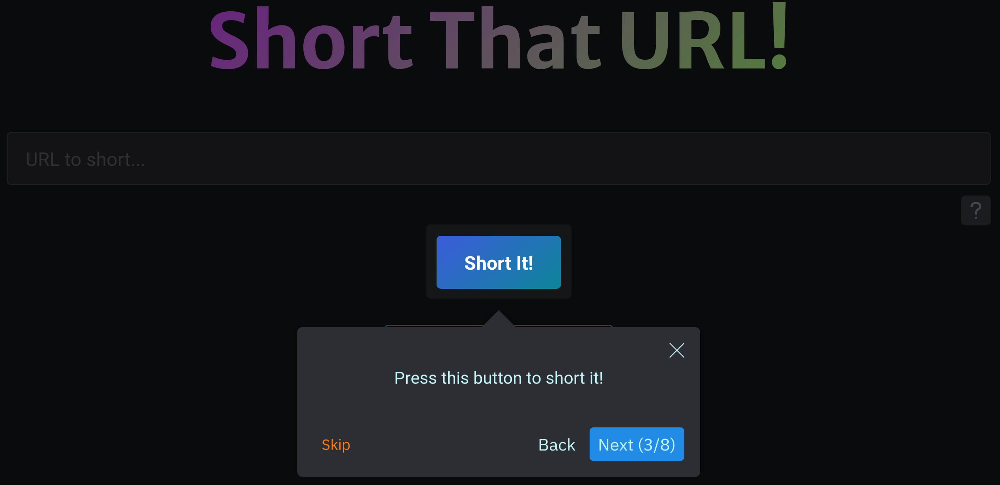
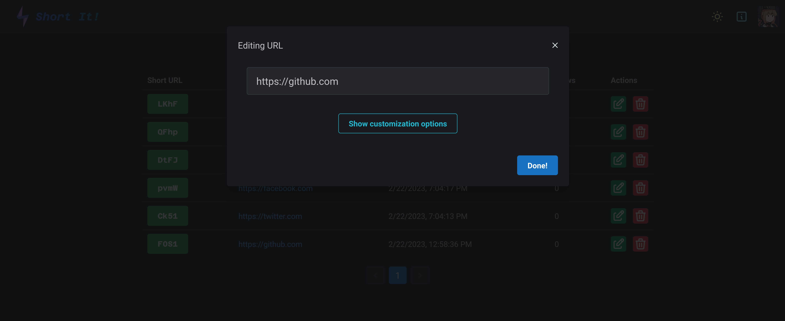
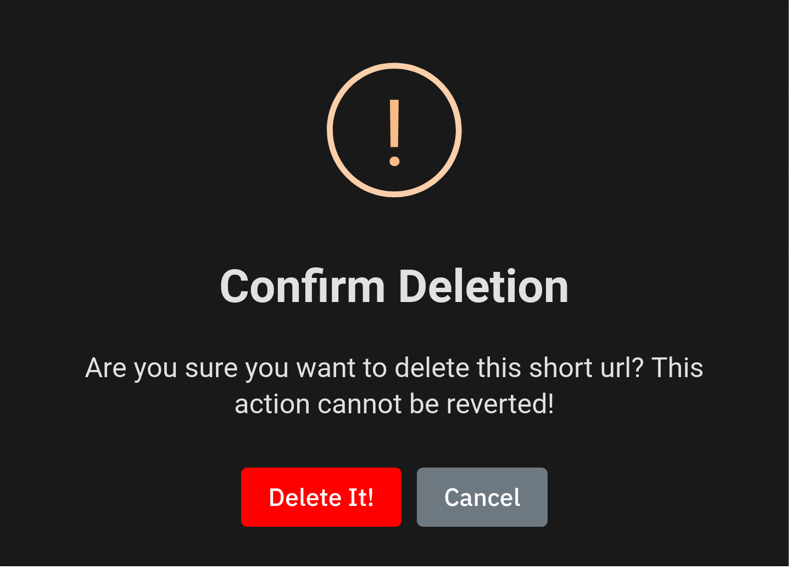

# Introduction

- [Introduction](#introduction)
  - [Homepage](#homepage)
    - [URL Input](#url-input)
    - [Submit Button](#submit-button)
    - [Customize](#customize)
    - [Custom OpenGraph Metadata](#custom-opengraph-metadata)
    - [Preview OpenGraph Metadata](#preview-opengraph-metadata)
    - [Example](#example)
    - [Tour](#tour)
  - [Manage](#manage)
    - [The URL Histories](#the-url-histories)
    - [Edit](#edit)
    - [Editing Metadata](#editing-metadata)
    - [Delete](#delete)

---

## Homepage

This is a static walkthrough of Short It!'s main features.  
You can also try this interactively on Short It!'s homepage by clicking on the question mark button.

### URL Input

Paste your URL into the input field.

### Submit Button

Click the Short It! button to get a shorten URL.

### Customize

Go into customization options by clicking the button.

### Custom OpenGraph Metadata

Set custom OpenGraph metadata in these fields.

### Preview OpenGraph Metadata

Short It! will generate previews accordingly.

### Example

An example with [ogp.me](https://ogp.me).

### Tour

Click the question mark button to get the interactive walkthrough.

## Manage

The manage page allows users to view/edit/delete created URLs.

### The URL Histories

Once you login to Short It!, you can see all the URLs created by you at the manage page.

### Edit

Clicking the "Edit" button in the action column to edit the URL.

### Editing Metadata

You can also edit OpenGraph metadata here.

### Delete

Clicking on the delete button, Short It! will prompt you if you really want to delete the URL.

